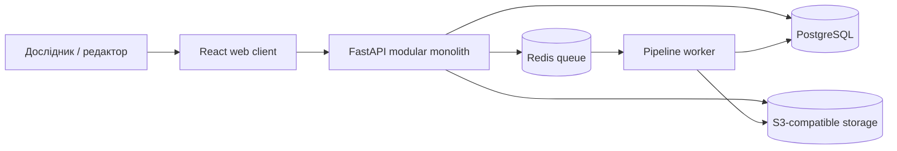
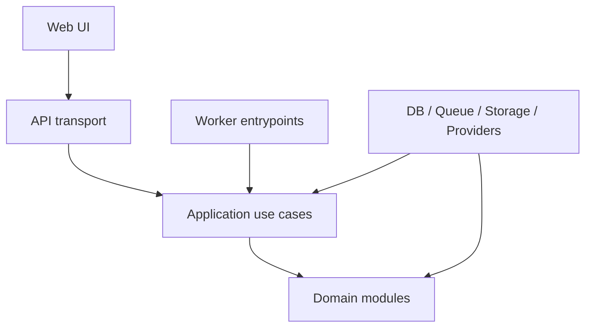

# Cadmus Dictionary Studio — архітектура MVP

Статус: **Accepted**  
Jira: **BH-175**  
Дата: **2026-08-13**

## 1. Мета документа

Документ фіксує межі першої версії Cadmus Dictionary Studio, відповідальність компонентів і дозволені залежності. Cadmus перетворює цифрові копії друкованих словників на структуровані лексикографічні записи зі збереженням зв'язку з першоджерелом і ручною перевіркою результату.

Архітектура першої версії — **модульний моноліт із окремим фоновим worker-процесом**. API та предметні модулі розміщуються в одному backend-коді й одній транзакційній базі, а довгі операції виконуються через чергу.

## 2. Межі MVP

### 2.1. Обов'язковий наскрізний сценарій

1. Користувач реєструється та входить у систему.
2. Створює проєкт словника й заповнює основні метадані та правовий статус.
3. Завантажує PDF і вибирає діапазон сторінок.
4. Система перетворює PDF на сторінкові зображення.
5. Користувач запускає OCR для вибраних сторінок.
6. Worker виконує preprocessing та OCR, зберігаючи текст, координати й confidence.
7. Інтерфейс накладає OCR-області на скан.
8. Система пропонує межі словникової статті та поля `headword`, `part_of_speech`, `definition`, `example`.
9. Редактор підтверджує або виправляє результат, не змінюючи оригінальний OCR-шар.
10. Перевірені записи експортуються щонайменше у JSON.

### 2.2. Функції MVP

- email/password authentication;
- один власник або редактор проєкту з базовим контролем доступу;
- PDF upload із перевіркою MIME, розміру та checksum;
- метадані й правовий статус джерела;
- конвертація PDF у сторінкові зображення;
- асинхронний, повторюваний pipeline;
- Tesseract як перший OCR-провайдер через спільний інтерфейс;
- OCR-токени, bounding boxes, confidence та сирий результат;
- базовий preprocessing зі збереженням перетворення координат;
- перегляд скану з OCR overlay;
- ручне виділення і редагування статей;
- baseline-сегментація статей і чотирьох типів полів;
- `source_text` окремо від `normalized_text`;
- provenance для структурованих полів;
- Human-in-the-Loop статуси перевірки;
- JSON export;
- базові метрики тривалості й помилок pipeline.

### 2.3. Out of scope першої версії

- Kubernetes, мікросервіси, Kafka та service mesh;
- real-time collaborative editing;
- автоматичне донавчання моделей та active learning loop;
- підтримка всіх типів словникових полів;
- семантичний пошук, embeddings, RAG і knowledge graph;
- автоматичне cross-dictionary linking; ручне підтверджене зіставлення з
  reference lexicon дозволене;
- автоматична нормалізація історичного правопису без підтвердження;
- повноцінний crowdsourcing і publisher workflow;
- нативні мобільні застосунки;
- on-premise інсталяційний продукт;
- гарантії production-scale високої доступності;
- білінг;
- TEI Lex-0 як блокувальна вимога першого наскрізного інкременту (архітектура має дозволяти додати його без зміни доменної моделі).

## 3. Контекст системи



Web-клієнт не звертається напряму до БД, Redis або файлового сховища. Worker не є окремою предметною системою: він запускає application use cases з того самого backend-коду.

## 4. Компоненти розгортання

| Компонент | Відповідальність | Технологічна основа |
|---|---|---|
| `web` | UI, OCR overlay, редактор, статуси задач | React, TypeScript, Vite |
| `api` | HTTP API, auth, use cases, транзакції, постановка jobs | Python 3.12, FastAPI |
| `worker` | preprocessing, OCR, layout/extraction, exports | Python, Celery або RQ |
| `postgres` | транзакційне ядро, JSONB, provenance, audit | PostgreSQL |
| `redis` | broker і короткочасний стан черги | Redis |
| `object-storage` | PDF, зображення сторінок, артефакти pipeline | MinIO локально, S3-compatible у production |

Усі компоненти локально запускаються Docker Compose. API і worker збираються з одного backend source tree, але запускаються різними процесами.

## 5. Bounded modules

| Модуль | Володіє | Не відповідає за |
|---|---|---|
| `identity` | користувачі, credentials, sessions, ролі | словники та OCR |
| `projects` | проєкти словників, членство й доступ | файли та pipeline |
| `sources` | джерела, метадані, правовий статус, файли, сторінки, скорочення | OCR-семантику |
| `processing` | processing run, етапи, статуси, конфігурації, retries | реалізацію конкретного OCR engine |
| `document` | normalized page geometry, blocks, lines, tokens, reading order | лексикографічні значення |
| `lexicography` | entries, fields, senses, source/normalized text | запуск pipeline |
| `review` | annotations, validation status, corrections, audit trail | автоматичне розпізнавання |
| `exports` | snapshots та serializers JSON/TEI | редагування записів |
| `quality` | gold samples, measurements, run statistics | production decisions без експериментів |
| `reference_lexicon` | versioned external lexical reference data, lemmas, word forms, license/provenance | OCR, source dictionaries, automatic semantic decisions |
| `geography` | синхронізований з decentralization.ua кеш areas/regions/communities/settlements, geometry громад, sync runs | зіставлення геолейблів словника з населеними пунктами |
| `notifications` | канали доставки сповіщень (email/Telegram) та їхній fan-out (`NotificationService`) | вирішення, коли й кого сповіщати -- це рішення викликача (worker entrypoint) |

## 6. Правило залежностей

Залежності спрямовані всередину: transport та infrastructure залежать від application/domain, але domain не імпортує FastAPI, Celery, SQLAlchemy, Redis, S3 SDK або OCR SDK.



Дозволені предметні залежності:

```text
identity
geography
reference_lexicon
notifications
projects -> identity
sources -> projects, geography
processing -> sources
document -> sources
lexicography -> document, sources, reference_lexicon
review -> lexicography, identity
exports -> lexicography, review
quality -> processing, document, lexicography, review
```

Зворотні імпорти заборонені. Наприклад, `document` не знає про `lexicography`, а `lexicography` не запускає `processing`. Взаємодія між модулями відбувається через application services, IDs, DTO та доменні події після commit.

`lexicography -> sources` (BH-54): лексема — ручне, доOCR-виділення (bounding box + текст) на зображенні сторінки, тобто майбутній прекурсор `headword`/`entry`. Вона посилається на `sources.Dictionary`/`sources.DictionaryPage` напряму, а не через `document`, бо `document` (нормалізована геометрія, отримана з OCR) на цьому етапі pipeline ще не існує й не має існувати — лексема створюється до запуску OCR. Коли реальний OCR/`document`-шар з'явиться, він продовжить використовувати `document -> sources`; ручний шлях лексем через `sources` лишається окремим і не є обхідним шляхом навколо `document`.

`reference_lexicon` — незалежний leaf-модуль для зовнішніх еталонних
лексичних даних. VESUM імпортується як versioned local cache з pinned GitHub
Release asset із фіксацією version, asset URL, SHA-256 checksum і license.
Morphology зберігається як raw tag string, повний ordered tag list і
консервативно розпарсені JSONB features. Дані reference lexicon не є
`sources.Dictionary`, не проходять OCR і не змінюють `source_text`.
`lexicography` може створювати лише явні підтверджені зв'язки з reference
lemma. Через відсутність окремої сутності sense у поточній MVP-моделі такий
зв'язок належить `DictionaryEntry`; після введення sense його можна
деталізувати без зміни reference-lexicon модуля.

`geography` — незалежний leaf-модуль без залежностей на будь-який інший предметний модуль: це спільний, tenant-independent кеш довідкових даних (areas/regions/communities/settlements), синхронізований окремим CLI-процесом. `sources` імпортує з нього лише для пошуку/зіставлення населених пунктів (`SettlementSearchService`, `SettlementMappingCrudService`, `SettlementConfirmationService`); зворотного імпорту `geography -> sources` немає.

`notifications` — так само незалежний leaf-модуль: `NotificationRecipient`/`Notification` — прості значення (адреси, текст), модуль нічого не знає про `identity.User` чи будь-яку доменну подію. Полiморфізм живе в `NotificationChannel` (`GmailNotificationChannel` через SMTP, `TelegramNotificationChannel` через Telegram Bot API) — `NotificationService.notify` перебирає канали й не зупиняється, якщо один з них впав. Worker entrypoint (не сам домен) складає `NotificationRecipient` з `identity.User` і вирішує, коли сповіщати — наприклад, після завершення `cadmus.lexicography.scan_dictionary`.

## 7. Основні потоки даних

### 7.1. Завантаження

1. API перевіряє доступ і метадані файлу.
2. Файл проходить MIME/size validation та отримує SHA-256 checksum.
3. Бінарні дані зберігаються в object storage.
4. У PostgreSQL створюється `SourceDocument` з URI, checksum, MIME, розміром і правовим статусом.
5. Потенційно небезпечний або юридично невизначений матеріал не публікується.

### 7.2. Обробка

1. API створює immutable `ProcessingRun` із версією pipeline та конфігурацією.
2. API ставить у Redis лише job ID, а не бінарний файл.
3. Worker читає source з object storage.
4. Кожний stage записує статус і versioned artifact.
5. Повторний запуск того самого stage з однаковими input checksum та config hash не створює дубліката.
6. Помилка етапу не видаляє успішні результати попередніх етапів.

### 7.3. Валідація

1. Автоматичний результат створюється як proposal.
2. Поле посилається на сторінку, координати, OCR-токени, run і confidence.
3. Ручне виправлення зберігається окремою revision/annotation.
4. `source_text` є незмінним спостереженням; `normalized_text` — окреме підтверджуване значення.
5. Експорт використовує лише дозволений validation status.

## 8. Канонічні контракти

OCR-провайдер реалізує порт на кшталт:

```python
class OcrProvider(Protocol):
    def recognize(self, page: PageInput, config: OcrConfig) -> OcrPage: ...
```

`OcrPage` містить provider/version, raw artifact reference, blocks, lines і tokens. Кожний token має `text`, `bounding_box`, `confidence` та стабільний ID. Provider-specific відповідь не потрапляє безпосередньо в доменну модель.

Тривала HTTP-операція повертає `202 Accepted` і `processing_run_id`. Прогрес читається через окремий endpoint. Контракти API документуються OpenAPI, а TypeScript DTO генеруються з нього.

## 9. Дані та provenance

Реляційно зберігаються стабільні сутності: user, project, source, page, processing run, entry, revision, annotation, export. JSONB використовується для provider output, конфігурацій і словниково-специфічних полів, але не замінює ключові зв'язки.

Мінімальний provenance структурованого поля:

- `source_document_id`;
- `page_id`;
- bounding box або список token IDs;
- `processing_run_id` та stage version;
- `source_text`;
- `normalized_text`, якщо існує;
- confidence;
- спосіб походження: `ocr`, `rule`, `model`, `manual`;
- автор і час ручної зміни.

## 10. Безпека й операційні обмеження

- недовірені PDF не обробляються всередині API-процесу;
- credentials та signed storage URLs не зберігаються в логах;
- доступ перевіряється в application use case, а не лише в UI;
- публікація залежить від правового статусу джерела;
- processing jobs мають timeout, retry policy та concurrency limits;
- health checks розрізняють liveness і readiness;
- audit trail є append-oriented;
- секрети надходять через environment/secrets provider і не комітяться.

## 11. Структура репозиторію

```text
cadmus-dictionary-studio/
├── apps/
│   ├── api/
│   │   └── src/cadmus_api/routes/
│   │       ├── geography.py
│   │       └── settlements.py
│   ├── worker/
│   │   └── src/cadmus_worker/
│   │       └── sync_geography.py
│   └── web/
├── packages/
│   └── backend/
│       └── src/cadmus/
│           ├── identity/
│           ├── projects/
│           ├── sources/
│           ├── processing/
│           ├── document/
│           ├── lexicography/
│           ├── review/
│           ├── exports/
│           ├── quality/
│           ├── geography/
│           ├── reference_lexicon/
│           └── infrastructure/
│               ├── geography.py
│               └── geography_client.py
├── infrastructure/
├── docs/
│   └── decisions/
├── fixtures/
└── tests/
```

Це логічні межі, а не вимога створювати дев'ять окремо опублікованих Python packages. До появи реальної потреби модулі залишаються частинами одного deployable backend.

## 12. Перевірка Acceptance Criteria BH-175

- [x] Компоненти та потоки даних описані.
- [x] MVP і out-of-scope сформульовані явно.
- [x] Напрямки залежностей визначені й не утворюють циклів.
- [x] Ключові рішення зафіксовані ADR у `docs/decisions/`.
- [x] Реалізація авторизації, OCR, layout analysis і словникової логіки не входить у цю зміну.

## 13. Persistence foundation

BH-179 реалізує PostgreSQL і керовані Alembic migrations без випередження
предметної моделі. SQLAlchemy mappings належать infrastructure layer і
реєструються на спільній metadata у PostgreSQL schema `cadmus`; предметний код
не імпортує SQLAlchemy. Деталі та відхилені альтернативи зафіксовано в
ADR-0005.
